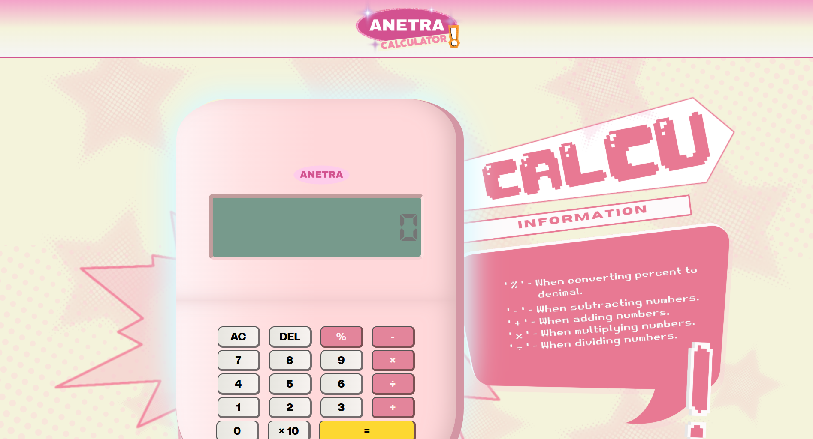

# ANETRA Calculator

<p align="center">
  
</p>

<p align="center">
  A cute and responsive calculator website built with HTML, CSS, and JavaScript.
</p>

<p align="center">
  <a href="https://anetra-calculator.vercel.app/">Live Demo</a>
</p>


<p align="center">
  
</p>

## Live Website

[Visit ANETRA Calculator](https://anetra-calculator.vercel.app/)

## About

ANETRA Calculator is a simple browser-based calculator with a playful pink design and a custom themed interface. It was created to perform everyday calculations while also focusing on visual style, responsiveness, and a fun user experience.

## Features

- Perform basic operations: addition, subtraction, multiplication, and division
- Support continuous calculations such as `2 + 2 + 2`
- Support decimal input
- Includes quick actions like `AC`, `DEL`, `%`, and `x10`
- Responsive layout for mobile, tablet, and desktop screens
- Custom UI with themed graphics, footer, and calculator styling

## Built With

- HTML5
- CSS3
- JavaScript

## Project Structure

```text
calculator/
|-- index.html
|-- css/
|-- js/
|-- img/
|-- font/
`-- README.md
```

## How to Run

1. Download or clone this repository.
2. Open the project folder in VS Code or any code editor.
3. Launch `index.html` in your browser.

You can also use the VS Code Live Server extension for easier preview while editing.

## Developer

**Jovilyn F. Esquerra**  

